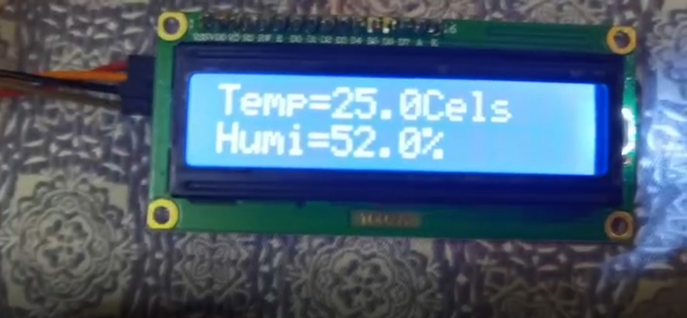
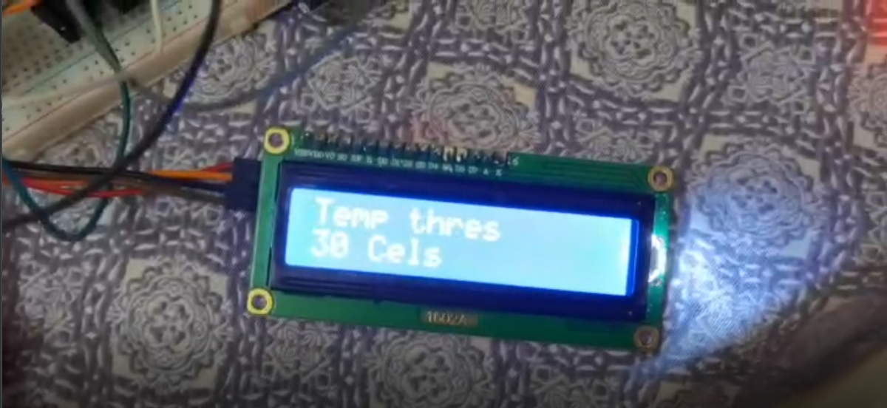
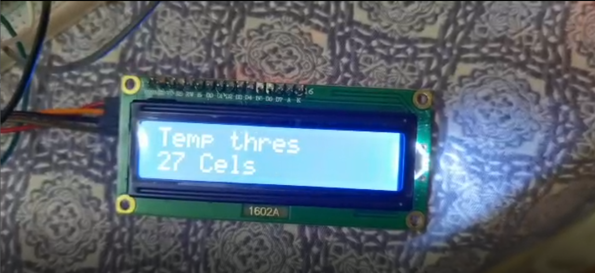
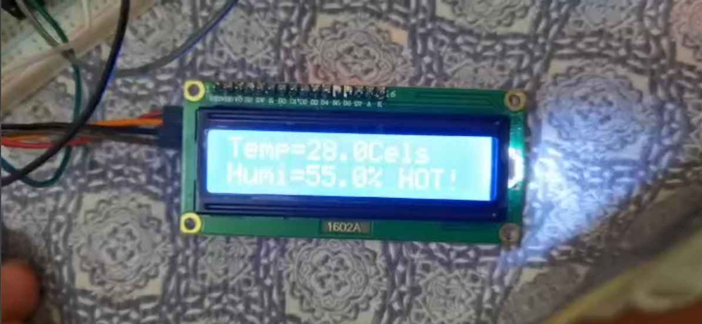
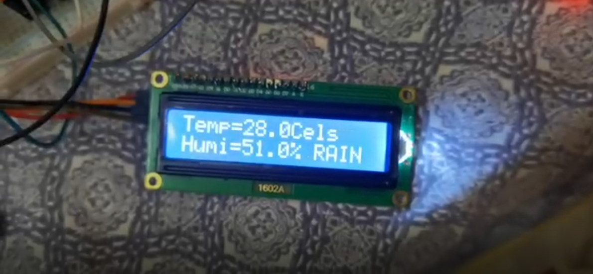

# Electronic-Technology-Internship
# USTB电子技术实习第一次作业
仅供参考
## 该作业使用模块如下
* PCF8591
* IIC LCD1602液晶显示
* 温湿度传感器
* 雨滴探测传感器
* 多色按钮
* 双色LED

本来想用个蜂鸣器的，但是发现竟然忘记带了（\捂脸）
## 功能介绍
本系统为智能农业管理系统，可以在农作物最需要的时候基于管理人员最需要的提醒。
~~没错，这也叫智能。~~
1. 首先进入一个HELLOWORLD的界面，但是很可惜我没有截到这张图
2. 然后引入眼帘的是显示屏显示当前的温度和湿度，一秒更新一次。
3. 其中还有一个我们自己设定的提醒的温度阈值，如果温度过高则会给出提醒。我们需要按下多色按钮的最右边的按钮，进入设置界面。
4. 使用上下按键来调整温度的阈值。
5. 如果温度达到阈值之上，则LED会闪红灯提醒，并且会在显示屏右下角加上一个HOT的字段。
6. 同样地，如果下雨的话，则也同样会闪红灯并且在屏幕右下角显示RAIN字段。
7. 本程序最大优点是使用asyncio库进行多线程编程，保证了所有部件都是同时运行而不会互相阻塞。并且构建了类似于总线一般的共享变量池，方便各部件之间进行数据交换。

本作业Github仓库：https://github.com/Eastforward/Electronic-Technology-Internship

Arthur:JZY